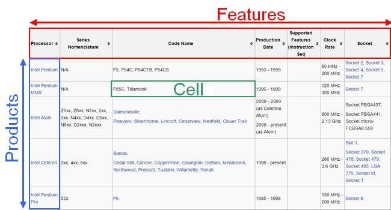
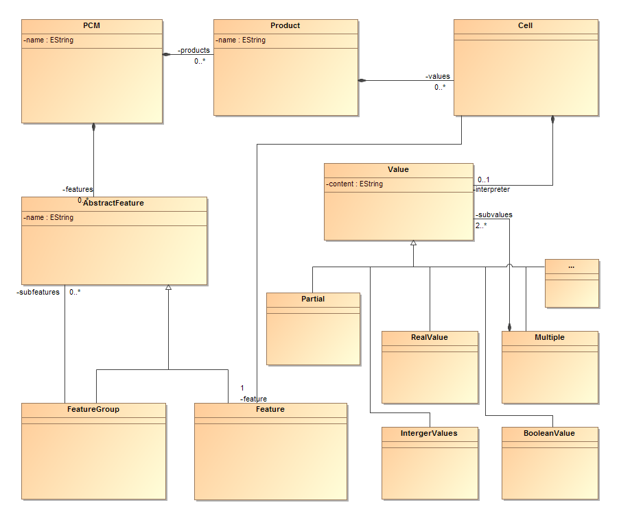

PCM
===

This project contains development artifacts used to perform research
around product comparison matrices (PCM). This work is currently
involving member of the diverse (DIVERsity-centric Software Engineering)
research team (<http://diverse.irisa.fr/>).

The project goal is to retrieve the source code of a Wikipedia
comparison page, and transform it into a .pcm file (can be an .html and
.csv as well). Wikipedia comparison page table are composed of raw
(products) and columns (features).

Development tools
=================

[Play Framework](https://www.playframework.com/)
------------------------------------------------

Play is a framework for developing web application with Java and Scala.
Built on Akka, which is a toolkit and runtime for building highly
concurrent, distributed, and resilient message-driven applications on
the JVM, Play provides predictable and minimal resource consumption
(CPU, memory, threads) for highly-scalable applications.

[IntelliJ](https://www.jetbrains.com/idea/download/)
----------------------------------------------------

IntelliJ is an IDE for Java, Scala and even Groovy. Specialized in
entreprise, web and mobile development, IntelliJ includes an amazing set
of tools which work out-of-the-box, such as Maven, Git, SVN and database
tools.

[Kevoree Modeling Framework Plugin](https://github.com/dukeboard/kevoree-modeling-framework)
--------------------------------------------------------------------------------------------

This project include the use of KMF plugin .

Maven
-----

Apache Maven is a software project management and comprehension tool.
Based on the concept of a project object model (POM), Maven can manage a
project’s build, reporting and documentation from a central piece of
information.

Continuous integration with Jenkins (<https://ci.inria.fr/>)
----------------------------------------------------------

Jenkins is an application that monitors executions of repeated jobs,
such as building a software project or jobs run by cron. Among those
things, current Jenkins focuses on the following two jobs:

1.  Building/testing software projects continuously

2.  Monitoring executions of externally-run jobs

Projects
========

The project is divided in many packages as individual projects too. This
is a summary of each :

  *  **org.diverse.PCM.api.java** : Java interfaces.
  *  **org.diverse.PCM.api.js** : Javascript interfaces.
  *  **org.diverse.PCM.api.java.impl** : Java implementations.
  *  **org.diverse.PCM.api.js.impl** : Javascript implementations.
  *  **org.diverse.PCM.formalizer** : the code who formalizes the differents types of files.
  *  **org.diverse.PCM.model** : contains the data model, takes care of the code source generation.
  *  **org.diverse.PCM.naive Frontend** : a naive website to show how to manipulate model in a browser
  *  **org.diverse.PCM.browser.io.ShoppingWebSite** : an example of the project uses. Parses shopping.com and creates PCMs associated.
  *  **org.diverse.PCM.io.Wikipedia** : the parsing code, which create PCMs from Wikipedia pages.
  * **org.diverse.PCM.input** : some matrix comparison code from Wikipedia in text files.
  * **org.diverse.PCM.ressources** : some examples of successfuls exports in PCM, CSV or HTML.
  * **org.diverse.PCM.play-app** : will contains the web editor.

Quick start
===========

    $ git clone https://github.com/StephaneMangin/PCM.git
    $ cd PCM/
    $ mvn clean install

Functionnalities
================

After retrieving the code source from Wikipedia and stored it into a
String variable (code), there is three steps:

Preprocessing
-------------

Replace the Wikipedia template (for example
FR) with the value displayed on the HTML page
(France/French or whatever) in the String code variable.

Parsing
-------

Parse the String code variable (without template) into a Page object
which is composed by Matrix object, itself composed by Cell object. At
this point we have the translation of the comparison table (Wikipedia
HTML page) into a Java Object (Page).

Normalization
-------------

Normalize the different Page object. For example, it is possible to have
a feature with two sub-columns (F1 composed by C1 and C2). The parsing
will create two features for each sub-column (F1C1 and F1C2).

Now that we have normalized Page objects, we can format them as HTML,
CSV or PCM with the three classes HTMLExporter, CSVExporter and
PCMModelExporter.

Simplified parsing use case
---------------------------

Wikipedia [*EDIT*]=\> source code [*PREPROCESS*]=\> source code without
template (display that is visible. e.g. replacing
FR) [*PARSE*]=\> intermediate structure
[*normalization*]=\> HTML | CSV | PCM model=\> WikipediaPageMiner

  *  [*EDIT*] = Templating
  *  [*PREPROCESS*] = `PreprocessVisitor`
  *  [*PARSE*] = `WikipediaPcmParser` , `PageVisitor` ,
    `TableVisitor` , `NodeToTextVisitor`

Simplified PCM class diagram
----------------------------

Complete project installation on Debian
=======================================

Getting and installing the tools
--------------------------------

### Git (Versionning management)

    # apt-get install git

### PCM project from github

    $ git clone https://github.com/gbecan/PCM.git

### Maven (Continuous integration server)

    # apt-get install maven2

### KMF - kevoree-modeling-framework

    $ mkdir $DEST_FOLDER
    $ cd $DEST_FOLDER
    $ git clone https://github.com/dukeboard/kevoree-modeling-framework.git
    $ cd kevoree-modeling-framework
    $ git checkout org.kevoree.modeling.root-3.5.12

### IntelliJ IdealC (IDE) 

    $ cd $DEST_FOLDER
    $ wget http://download.jetbrains.com/idea/ideaIC-13.1.6.tar.gz
    $ tar xzvf idealC-13.1.6.tar.gz

### Play2

    $ cd $DEST_FOLDER
    $ wget http://downloads.typesafe.com/typesafe-activator/1.2.10/typesafe-activator-1.2.10-minimal.zip
    $ unzip typesafe-activator-1.2.10-minimal.zip
    $ cd activator-1.2.10-minimal
    $ chmod a+x activator

### Java runtime 7 JRE

    # apt-get install openjdk-7-jre

### Java runtime 8 JRE (prefered)

    # echo oracle-java8-installer shared/accepted-oracle-license-v1-1 select true | sudo /usr/bin/debconf-set-selections
    # sudo apt-get install oracle-java8-installer

Environnement configuration
---------------------------

In the file *~/.profile* (create it if it does’nt exist), append at the
end of the file :

    M2_HOME="/usr/share/maven2"
    PLAY2_HOME="$DEST_FOLDER/activator-1.2.10-minimal"
    # set PATH so it includes user's private bin if it exists
    if [ -d $M2_HOME ] ; then
    export PATH="$M2_HOME:$PATH"
    fi
    if [ -d $PLAY2_HOME ] ; then
    export PATH="$PLAY2_HOME:$PATH"
    fi

Finally, source it :

    $ source ~/.profile

Launching
---------

    $ cd $DEST_FOLDER/kevoree-modeling-framework
    $ mvn clean install
    $ cd ../PCM/org.diverse.PCM
    $ mvn clean install

if errors with java runtime 7 -\> forced version to 1.7 :

    $ mvn clean install -Dmaven.compiler.target=1.7 -Dmaven.compiler.source=1.7

Unit Tests
----------

    $ cd $DEST_FOLDER/PCM/org.diverse.PCM
    $ git pull
    $ mvn test -Dtest=WikipediaMinerTest
    $ mvn test -Dtest=ParserTest

if errors with java runtime 7 -\> forced version to 1.7 :

    $ mvn test [...] Dmaven.compiler.target=1.7 -Dmaven.compiler.source=1.7

Information
===========

### PCMs examples on the wiki

-   <http://en.wikipedia.org/wiki/Comparison_of_Intel_processors>

-   <http://en.wikipedia.org/wiki/Comparison_of_BitTorrent_clients>

-   <http://en.wikipedia.org/wiki/Comparison_of_audio_player_software>

### Materials

Wikipedia PCMs list are located on the project resources folder

-   <http://github.com/gbecan/PCM/blob/master/org.diverse.PCM/org.diverse.PCM.io.Wikipedia/ressources/list-of-PCMs.txt>

