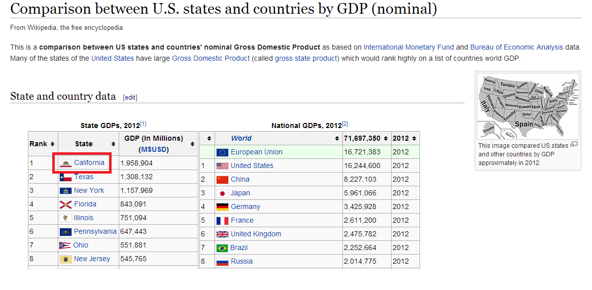

<h1 style="text-align:center; color:#2E36D4"> Wikipedia PCM project </h1>

 
### STEPS AND PROCESSING :
In this part, we will explain how the PCM project works with Wikipedia :  
To begin, let's do a quick view of Wikipedia PCM system.  
I give your attention on the red box, we can see a small picture of the California flag next to California name. If we click on "edit", we will be able to see how this part is represented :
 

Still in the red box, you can see <code> {{Flag | California}} </code>.
This is a template, a useful but not friendly function of Wikipedia to replace an instance by a smallest code. This is what will be transformed in his real value when our PCM project will preprocess the file. Let's explain this :
 

The program starts with getting a page from Wikipedia, with the <code> getPageCodeFromWikipedia </code> function.  
It takes the article title as an argument and create the url link. Then it goes in the edit function, to parse the code as an XML file.
 

The second step is the preprocess function, it will parse the code to replace all of the templates by it real value.
 

The third step is the <code> parse </code> function, where the Product Comparison Matrice will be normalized.  
That means every multiple column or multiple line will be divided in few simples.
 

To finish, we can export the new PCM in HTML, CSV, or PCM.
 

The diagram in the following page summarizes what we have just described :
 

### CONCEPTION : 

